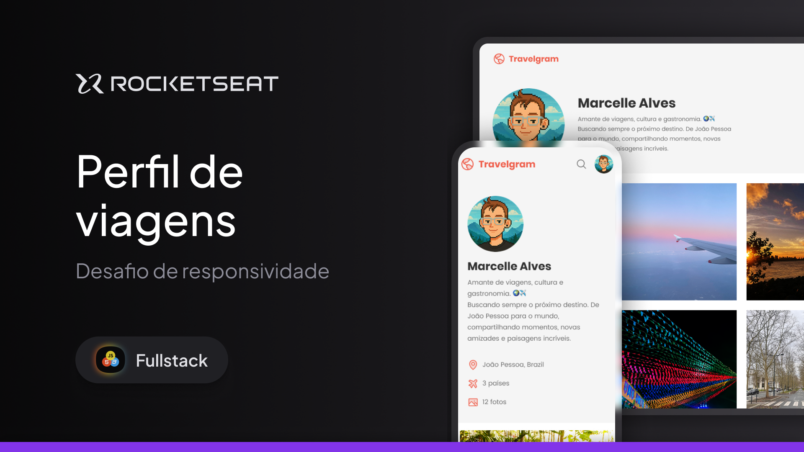

# Travelgram ✈️

## **_Desafio prático de HTML, CSS e responsividade_**

  
   
  <small>O design original deste projeto, incluindo o thumbnail, foi criado pela Rocketseat. A implementação, o código, imagens e conteúdos são de minha autoria e alterados para personalização.</small>
    
  

---

### 🔗 Sumário

-   [💻 Sobre o Projeto](#-sobre-o-projeto)
-   [✨ Design Original](#-design-original)
-   [🚀 Tecnologias Utilizadas](#-tecnologias-utilizadas)
-   [📄 Licença](#-licença)
-   [📧 Contato](#-contato)

---

### 💻 Sobre o Projeto

Este projeto, chamado Travelgram, foi desenvolvido como parte do desafio da **Formação Fullstack da Rocketseat**. O objetivo principal era praticar e consolidar os conhecimentos em **HTML** e **CSS**, com um foco especial em **criação de layouts responsivos**.

O grande aprendizado foi a abordagem **_mobile-first_**, ou seja, comecei o desenvolvimento pensando na experiência para telas pequenas e depois adicionei as adaptações para desktops. Essa metodologia garante que a aplicação seja leve e otimizada para dispositivos móveis desde o início.

---

### ✨ Design Original

O layout deste projeto foi idealizado pela equipe da Rocketseat. Você pode acessá-lo e ver a versão original no Figma:

-   [Acessar Design no Figma](https://www.figma.com/community/file/1392188119249243534/perfil-de-viagens)

---

### 🚀 Tecnologias Utilizadas

-   **HTML**: Estrutura e marcação do conteúdo.
-   **CSS**: Estilização e design do layout.
-   **Media Queries**: Para garantir a responsividade em diferentes tamanhos de tela.

---

### 📄 Licença

Este projeto está sob a licença MIT.

---

### 📧 Contato

Se você gostou do projeto ou tem alguma sugestão, pode me encontrar no [LinkedIn](https://www.linkedin.com/in/marcelle-alves-724608315) ou no [GitHub](https://github.com/devchinninto).